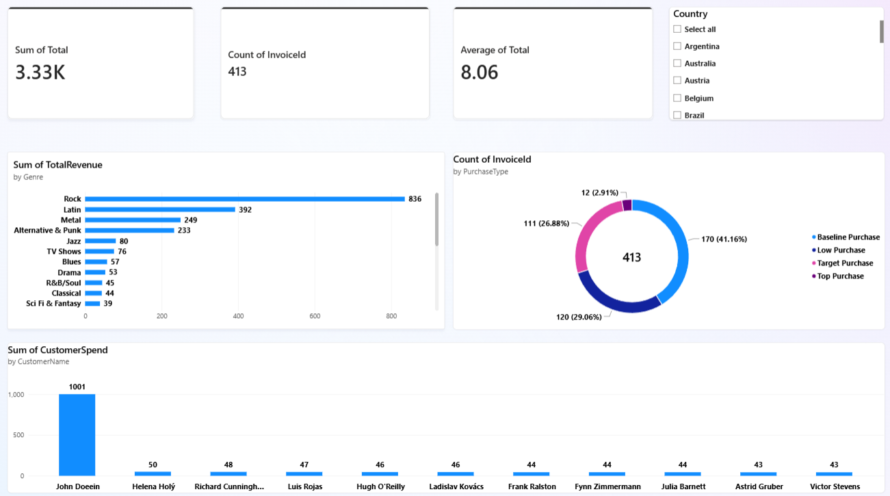

# 🎵 Chinook Sales & Customer Dashboard

A Power BI project analyzing revenue performance, genre trends, and customer spending for the Chinook digital music store.

---

## 📌 Business Summary
* **Total Revenue:** $3.33K
* **Total Orders:** 413
* **Average Order Value:** $8.06

---

## 💡 Key Insights
* **Top Genre:** **Rock** is the primary revenue driver ($1.02K+), followed by *Latin* ($392) and *Metal* ($249).
* **Customer Spend:** High revenue concentration in top account *John Doeein* (~$1,001), while remaining top customers average **$43–$50**.
* **Order Types:** **Baseline Purchases** account for the largest share of transactions (**41.16%**).

---

## 🛠️ Tech Stack
* **Power BI** (Data Modeling, Dashboard Design)
* **SQL / SQLite** (Data Extraction & Aggregation)

---

## 📂 Project Structure
* `dashboard/` — Power BI `.pbix` file
* `data/` — Dataset files
* `screenshots/` — Dashboard preview
